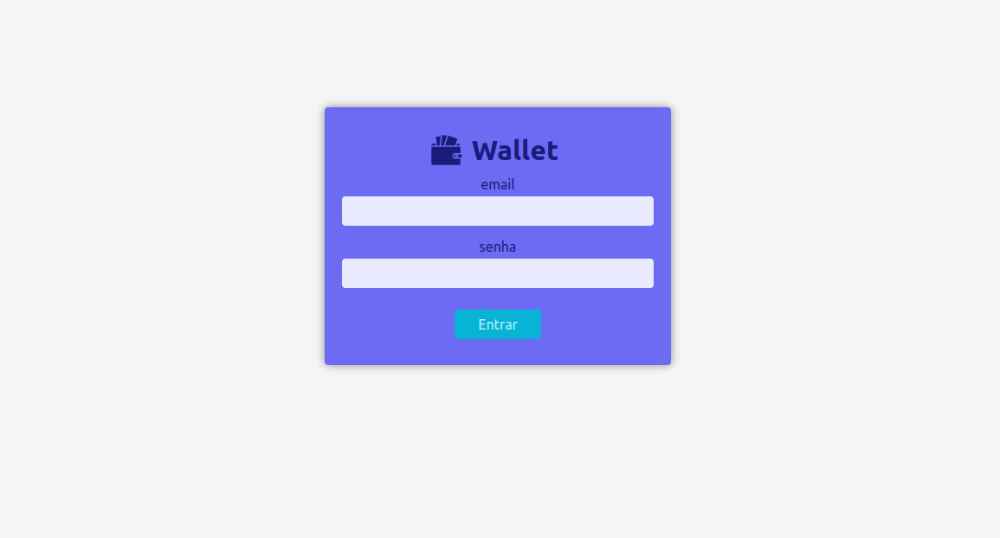
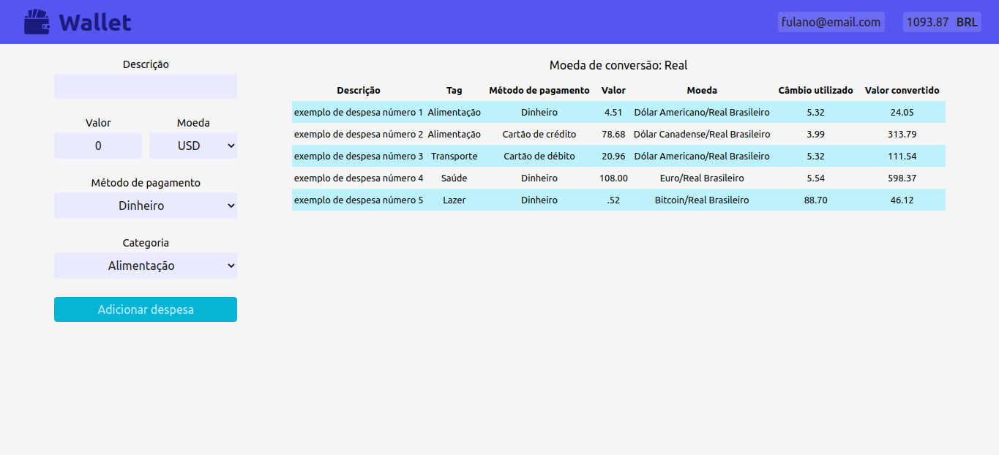

<h1 align="center">
  :purse: Wallet :money_with_wings:
</h1>

&emsp;

## Sobre o projeto

***Projeto realizado durante módulo de Frontend na Trybe, entre 31 de Março e 06 de Abril de 2022.***

Wallet é uma carteira de controle de gastos com conversor de moedas.

Esta aplicação permite ao usuário fazer login, adicionar um gasto, visualizar uma tabelas com seus gastos e visualizar o total de gastos convertido para uma moeda de escolha.

  

  

Essa aplicação foi feita em [React](https://pt-br.reactjs.org/docs/getting-started.html) utilizando o conjunto de ferramentas [Create React App](https://pt-br.reactjs.org/docs/create-a-new-react-app.html) e o [React Router](https://v5.reactrouter.com/) para navegação entre as rotas.

As configurações do linter foram fornecidos pela equipe da [Trybe](https://www.betrybe.com/), escola de programação onde eu realizei este projeto, o restante foi desenvolvido por mim.

> Acesse a página do projeto em https://leticia-238.github.io/wallet

## Tecnologias e Ferramentas utilizadas

**`React`** **`Redux`** **`React Router`** **`CSS`**

## Instruções para a instalação

### Pré-requisitos para iniciar a aplicação no computador:

- git
- node 16

### Execute os seguintes passos no terminal:

1. Clone o projeto: `git clone git@github.com:leticia-238/wallet.git`

2. Entre na pasta do repositório clonado: `cd wallet`

3. Instale as dependências: `npm install`

4. Inicialize a aplicação no navegador: `npm start` (abre uma nova página em http://localhost:3000/wallet)
